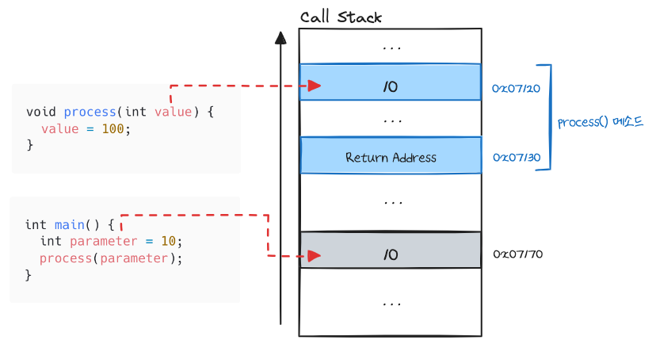
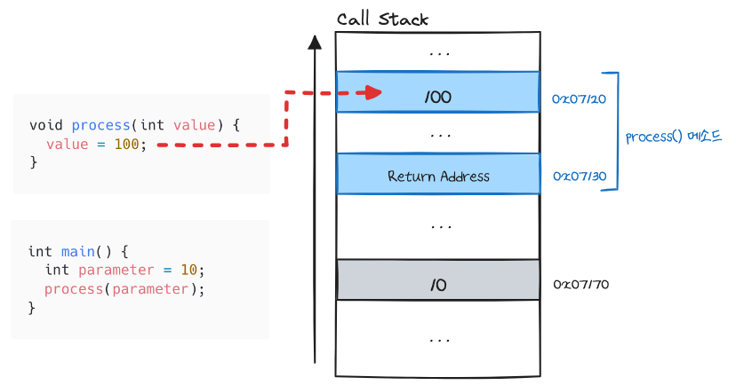
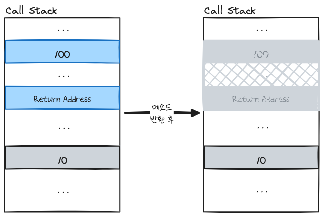
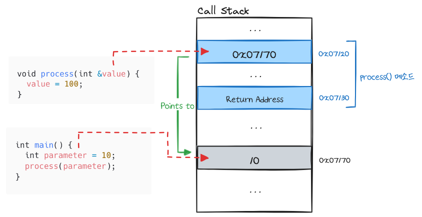
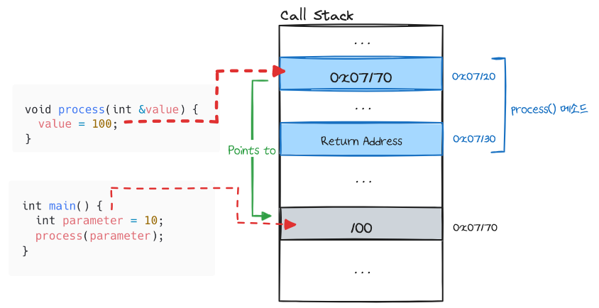
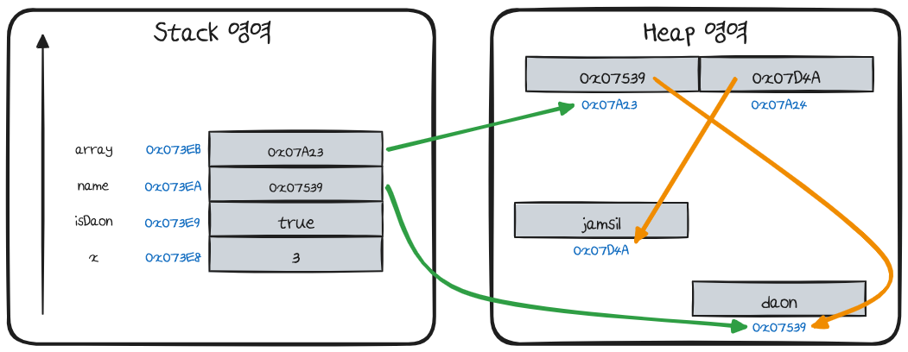
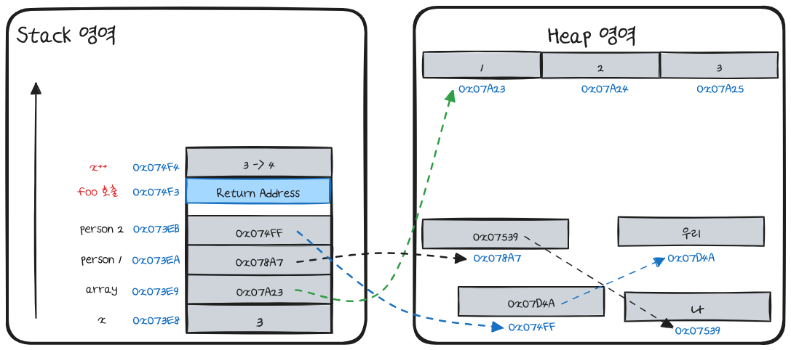
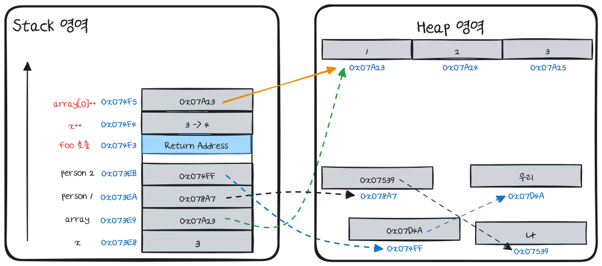
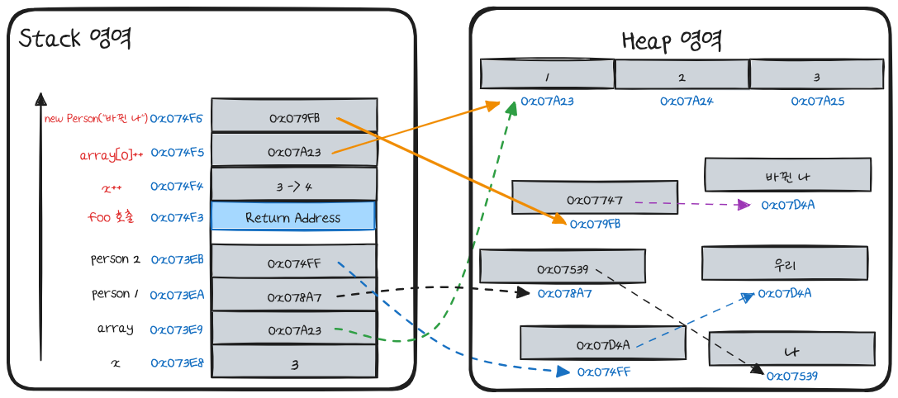
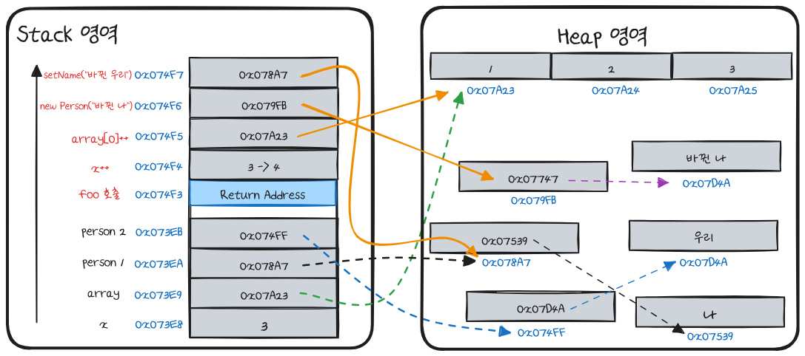

# Java가 파라미터 변수를 넘겨주는 방법

개발을 하다보면 필연적으로 메소드에 매개변수로 변수를 넣는 경우가 빈번히 일어나는데요. 개발 언어는 변수나 메소드에 정보를 전달하는 방식이 모두 다릅니다.  가장 일반적인 파라미터 전달 방식은 Pass by Value, Pass by Reference입니다. 이 두 방식에 대해 알아보고 Java는 어떠한 방식을 사용하는지 알아보겠습니다.

## 용어 정리
### Pass-by-Value (Call-by-Value)
먼저 Pass by Value의 정의입니다. Pass by Value는 매개변수로 데이터의 복사본을 전달하게 되며 이 값의 변경 사항은 원본 데이터에 반영되지 않습니다. 다시 말해 메서드 안에서 수행된 모든 수정 사항은 메서드 밖의 원래 매개변수에 영향을 미치지 않습니다.

코드로 예시를 들어보겠습니다. 예시는 Pass by Value와 Pass by Reference를 둘 다 사용할 수 있는 C++ 언어로 들겠습니다.
```cpp
#include <iostream>

using namespace std;

void process(int value) {
    // 문자열과 변수의 값을 줄바꿈과 함께 콘솔에 출력한다
    cout << "Value passed into function: " << value << endl;
    value = 100;
    cout << "Value before leaving function: " << value << endl;
}

int main() {
    int parameter = 10;
    cout << "Value before function call: " << parameter << endl;
    process(parameter);
    cout << "Value after function call: " << parameter << endl;

    return 0;
}
```
다음과 같이 `process()` int 타입의 매개변수를 받아 콘솔에 출력하는 메서드를 구현하고 `main()` 메서드에서 실행해본다면 어떤 결과가 나올까요?

```bash
Value before function call: 10                                                                                                                                              
Value passed into function: 10                                                                                                                                                    
Value before leaving function: 100                                                                                                                                                
Value after function call: 10
```
`process()` 메소드를 수행한 후 마지막 출력 결과에서 `paramter` 변수의 값을 100으로 예상할 수 있지만 앞에서 말한 Pass by Value의 동작으로 인해 실제로는 처음 할당된 10에서 변하지 않았습니다.
이 동작을 프로그램 실행 중에 함수 호출을 관리하는 데이터 구조인 Call Stack을 통해 알아보겠습니다.

### Pass by Value Call Stack



먼저 main 메소드에서 호출한 int형 매개변수인 parameter가 Call Stack에 쌓이며 이후 process 함수가 호출될 때 Call Stack에 Return Address를 저장합니다. 여기서 Return Address란 함수가 실행을 마치고 다시 돌아가야 할 위치를 저장하는 메모리 주소를 말합니다. 다음으로 매개변수인 int형 변수 value가 Call Stack에 쌓입니다.

이때 10이라는 값이 동일하게 저장될 뿐 서로 다른 메모리 주소로 저장하게 됩니다.
위의 그림에서도 본다면 main() 메소드의 parameter 변수는 0x7170 주소 값을 process() 메소드의 value 변수는 0x71270 주소 값을 가지는 것을 확인할 수 있습니다.



그래서 process() 메소드 내 value 변수의 값을 변경하면 메모리에 할당된 값만 바뀌게 됩니다.



이후 메소드가 반환되면 process() 메소드가 할당된 Call Stack이 pop되어 메모리가 소멸됩니다. 그렇기에 `process()` 메소드를 수행한 뒤에 parameter 변수를 출력하여도 처음 할당한 10을 변화없이 그대로 유지됩니다.

이러한 매개변수 전달 방식을 Pass by Value 라 합니다.


## Pass by Reference

다음은 Pass by Reference 에 대해 알아보겠습니다. Pass by Reference 는 주소 값을 전달하여 동일한 데이터에 대해 여러 변수 이름을 사용합니다. 그래서 이 값을 수정하면 원본의 데이터도 함께 수정되게 됩니다.
코드로 예시를 들어보겠습니다.

```cpp
#include <iostream>

using namespace std;

// c++은 참조값을 전달하기 위해 &를 사용한다.
void process(int& value) {
    // 문자열과 변수의 값을 줄바꿈과 함께 콘솔에 출력한다
    cout << "Value passed into function: " << value << endl;
    value = 100;
    cout << "Value before leaving function: " << value << endl;
}

int main() {
    int parameter = 10;
    cout << "Value before function call: " << parameter << endl;
    process(parameter);
    cout << "Value after function call: " << parameter << endl;

    return 0;
}
```
위와 같이 process() 메소드를 구현하고 main() 메소드를 실행해보면 이전과 다른 결과가 도출된다.

```bash
Value before function call: 10                                                                                                                                              
Value passed into function: 10                                                                                                                                                    
Value before leaving function: 100                                                                                                                                                
Value after function call: 100
```

이번에는 값을 복사한 것이 아닌 Alias를 넘겼기에 process() 함수에서 변경된 값이 원본에도 영향을 미치게 되었다.
Pass by Reference 방식도 Call Stack으로 알아보겠습니다.

### Pass by Reference Call Stack



Pass by Reference 또한 main() 메소드에서 선언된 parameter 변수가 stack에 쌓이고 process() 메소드 호출 시 Return Address가 쌓이게 됩니다. 그 후 매개변수 정보를 stack에 저장하게 되는데요. 이때 저장 되는 것은 10 이라는 값이 아닌 parameter 의 값이 저장된 메모리의 주소를 저장하게 됩니다.



다시 말해, process 메소드에서 매개변수로 전달 받은 value는 parameter가 저장된 값을 참조하는 Alias이며 value를 변경하는 것은 value의 메모리에 저장된 주소 값이 가리키는 메모리인 parameter의 값을 변경하는 것입니다.

때문에 process 메소드가 반환된 이후 parameter는 100으로 수정된 값으로 콘솔에 출력되게 됩니다.

## Java의 동작 방식

그렇다면 Java는 어떤 동작 방식을 따를까요? JLS(Java Language Specification) 1.0부터 SE 23 까지 모든 명세의 8.4.1 절에는 이렇게 언급하고 있습니다.

> When the method or constructor is invoked (§15.12), the values of the actual argument expressions initialize newly created parameter variables, each of the declared type, before execution of the body of the method or constructor.

다시 말해 Java는 Pass by Value 임을 나타내고 있습니다.

이를 보았을 때 ‘Java는 원시 타입과 참조 타입이 존재 하는데 어떻게 값으로 전달하는 거지?’란 의문이 들으실 수도 있습니다.

이는 Java의 각 변수 타입별 메모리 할당 방식에 대해 이해가 필요합니다.

## JVM 메모리 할당 방식
Java는 메모리를 크게 Stack 영역, Heap 영역, Method 영역으로 나눌 수 있는데요. 변수를 선언할 때 할당되는 메모리는 Stack과 Heap이 있습니다. Stack 영역은 LIFO 구조로 푸시된 순서에 따라 쌓이고 가장 최근에 추가된 데이터부터 꺼내집니다. 이와 반대로 Heap 영역은 비연속적인 메모리 블록으로 메모리의 어느 위치에서나 할당됩니다. (이로 인해 JVM은 Garbage Collector로 힙 메모리에 생성된 객체를 관리하며 더 이상 참조되지 않는 객체를 감지하여 메모리를 자동으로 해제합니다.)

아래 코드로 예시를 들어보겠습니다.
```java
public class MemoryEx {
    
    public void ex() {
        int x = 3;
        boolean isDaon = true;
        String name = "daon";
        String[] array = new String[2];
        array[1] = new String("daon");
        array[2] = "jamsil";
    }
}
```
다음과 같은 형태의 변수가 저장되는 것을 그림으로 나타내면 아래와 같습니다.



> String의 값인 “daon”은 Heap 메모리에 저장되지만 다른 객체가 저장되는 것과 달리 다르게 동작합니다. 자세한 내용은 `리터럴 풀`을 찾아보시길 권장드립니다.

### 1. Java의 원시 타입

Pass by Value에서 설명한 방식과 동일하게 동작합니다.

### 2. 참조 타입 배열 array

Java의 참조 타입인 객체는 좀 더 확장된 규칙이 적용됩니다. 위 그림에서 보듯이 객체는 값이 아닌 실제 메모리를 가리키는 포인터를 저장합니다.
그래서 객체가 전달된다면 이 포인터의 값이 복사되어 전달되는 것입니다.

JLS의 4.3.1 절 Object 에 따르면 이를 Java 내에서 Object Reference라 부르며 이를 통해 가능한 연산들을 규정해두었습니다.
- Field 접근
- Method Invocation
- Cast Operator
- String의 `+` 연산자와 호출되면 `toString()` 메서드를 호출하여 문자열로 변환하여 연결한다.
- instanceof 연산자
- == 또는 != 또는 ? :

정리한다면 참조 타입인 객체는 매개변수로 전달될 때 몇가지 연산은 가능하지만 그 객체 자체의 변경은 불가능하다는 것이다.

## 코드와 메모리를 통한 예제

코드 예제를 통해 Java의 Pass by Value 동작을 알아보겠습니다.

```java
class Person {
    
    private String name;
    
    public Person(String name) {
        this.name = name;
    }
    
    public String getName() {
        return name;
    }
    
    public void setName(String name) {
        this.name = name;
    }
}


public class Main {
    
    public static void main(String[] args) {
        int x = 3;
        int[] array = {1, 2, 3};
        Person person1 = new Person("나");
        Person person2 = new Person("우리");
        
        foo(x, array, person1, person2);

        System.out.println("x: " + x);
        System.out.println("array[0]: " + array[0]);
        System.out.println("person1.name: " + person1.getName());
        System.out.println("person2.name: " + person2.getName());
    }
    
    private static void foo(int x, int[] array, Person person1, Person person2) {
        x++;
        array[0]++;
        person1 = new Person("바뀐 나");
        person2.setName("바뀐 우리");
    }
}
```


```bash
x: 3
array[0]: 2
person1.name: 나
person2.name: 바뀐 우리
```

각 동작을 메모리 구조와 함께 알아겠습니다.

### 1. 원시 타입 x


변수 x의 동작은 앞서 Pass by Value의 개념으로 이해 가능하니 생략하겠습니다.

### 2. 참조 타입 배열 array


참조 타입은 생성된 객체 내에 접근하여 값을 변경하는 것이 가능합니다.
때문에 포인터에 해당하는 배열의 값을 바꾸면 실제 배열에도 반영이 됩니다.

### 3. 참조 타입 Person 1


`foo()` 안에서 Person 1을 새로운 Person 객체에 할당하였습니다.
이 동작을 수행하면 아래 그림과 같이 아예 다른 메모리 주소를 참조하도록 바뀌게 됩니다.
그로 인해 `foo()`가 반환되더라도 변경이 유지되지 않는다.

### 4. 참조 타입 Person 2


Person 2 또한 동일한 메모리 주소를 바라보기에 위에서 설명한 내용과 동일하게 객체 내 필드에 접근하여 값을 변경 가능하는게 가능합니다.

## 결론

매개변수가 전달되는 두 방식 Pass by Value 와 Pass by Reference 에 대해 알아보고 Java 가 어떻게 Pass by Value로 동작하는지 알아보았습니다.
이러한 방식을 아는 것은 미묘하지만 치명적인 실수를 방지할 수 있는 길이 됩니다.

---
### 참고 자료
[Java Language Specification 1.0](https://titanium.cs.berkeley.edu/doc/java-langspec-1.0/)
- Written by: James Gosling, Bill Joy, Guy Steele
- Created on: Aug. 1996
- Referenced on: Sep. 28, 2024
  
[The Java Language Specification, Java SE 23 Edition](https://docs.oracle.com/javase/specs/)
- Written by: Oracle
- Created on: Sep. 2024
- Referenced on: Sep. 28, 2024

[Passing by Value vs. Passing by Reference in Java](https://dzone.com/articles/pass-by-value-vs-reference-in-java)
- Written by: Justin Albano
- Created on: Oct. 20, 2017
- Referenced on: Sep. 28, 2024

[Pass-By-Value as a Parameter Passing Mechanism in Java](https://www.baeldung.com/java-pass-by-value-or-pass-by-reference)
- Written by: Baeldung
- Last Updated on Jan. 8, 2024
- Referenced on Sep. 28, 2024

[[Java] 메모리 관리 및 Pass By Value의 동작 방식 (2/3)](https://mangkyu.tistory.com/106)
<br/>[[Java] Pass By Value와 Pass By Reference의 차이 및 이해 (3/3)](https://mangkyu.tistory.com/106)
- Written by: 망나니개발자 (aka. Mangkyu)
- Created on Jan. 18, 2021
- Referenced on Sep. 28, 2024
